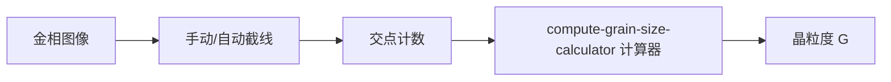

# 铁素体晶粒度自动化评级系统

## 一句话定位

基于 GB/T 6394—2017 截点法，构建铁素体晶粒度的半自动/自动化评级工具链——从金相图像到晶粒度级别数 G 的一站式计算。

## 数据集

原始金相图像位于：
`/media/chenguisen/WD_BLACK1/AISI/首钢驻场资料编写/数据集/铁素体晶粒度测试/`

共 ~82 张图像，涵盖 7+ 个钢材试样的边部、心部、四分之一处，
放大倍数 200×、500×、1000×。

## 关联原子

### 方法组件
- `method-gb-t6394-intercept`：GB/T 6394—2017 截点法晶粒度测定

### 结果讨论
- `result-ferrite-grain-dataset`：铁素体晶粒度测试数据集

### 计算工具
- `compute-grain-size-calculator`：晶粒度截点法计算器

## 工作流

## 进度日志

| 日期 | 进展 | 阻塞 |
|------|------|------|
| 2026-06-23 | 数据集整理入库（result-ferrite-grain-dataset），方法文档化（method-gb-t6394-intercept），计算器建成（compute-grain-size-calculator） | 需人工验证截点法计算精度 |

## 产出链接

<!-- 论文草稿 / 提交记录 / 演讲 slides 路径 -->

## 复盘

<!-- 完成后填写 -->
